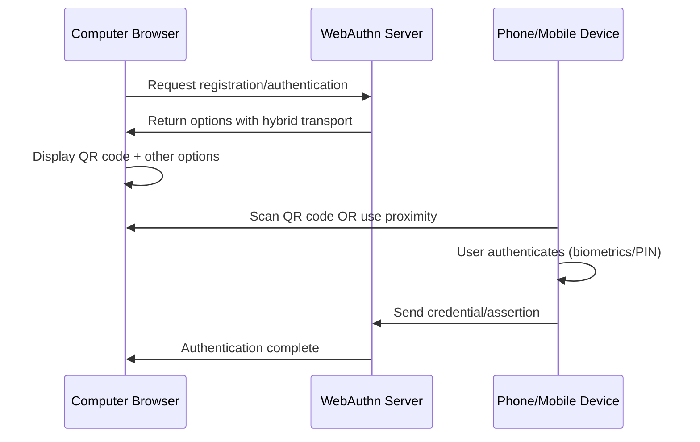

# Hybrid WebAuthn Documentation

## Overview

**Hybrid WebAuthn** is a cross-device authentication mechanism that allows users to authenticate on one device (e.g., computer) using an authenticator on another device (e.g., smartphone). This implementation provides maximum flexibility by supporting QR code/phone passkeys, security keys, and platform authenticators simultaneously.

## What is "Hybrid" in WebAuthn?

### Transport Type
In the WebAuthn specification, `hybrid` is one of several transport types:
- `usb` - USB security keys (YubiKey, etc.)
- `nfc` - Near Field Communication authenticators
- `ble` - Bluetooth Low Energy authenticators  
- `internal` - Platform authenticators (Touch ID, Face ID, Windows Hello)
- **`hybrid`** - Cross-device authentication

### Cross-Device Authentication Flow



## Implementation Architecture

### Backend Components

#### 1. Hybrid Registration Endpoint
```swift
// Sources/MultiPeerChatCore/WebAuthnServer.swift
case "/webauthn/register/begin/hybrid":
    response = try await handleHybridRegistrationBegin(request: request)
```

#### 2. Hybrid Authentication Endpoint  
```swift
// Sources/MultiPeerChatCore/WebAuthnServer.swift
case "/webauthn/authenticate/begin/hybrid":
    response = try await handleHybridAuthenticationBegin(request: request)
```

#### 3. WebAuthn Manager Methods
```swift
// Sources/MultiPeerChatCore/WebAuthnManager.swift
public func generateHybridRegistrationOptions(username: String) throws -> PublicKeyCredentialCreationOptions

public func generateHybridAuthenticationOptions(username: String? = nil) throws -> PublicKeyCredentialRequestOptions
```

### Frontend Components

#### 1. Hybrid WebAuthn Client
- **File**: `static/hybrid-webauthn.js`
- **Purpose**: Specialized client that always uses hybrid endpoints
- **Usage**: Test page and hybrid-specific implementations

#### 2. Test Interface
- **File**: `static/hybrid-webauthn-test.html`  
- **URL**: `http://localhost:8080/hybrid-webauthn-test.html`
- **Purpose**: Testing and demonstrating hybrid functionality

## Android Support

Android devices are now **sandboxed from Linux code paths**. Previously, Android's user agent (which contains "Linux") caused Android devices to be routed through Linux-specific code, bypassing biometric authenticators and credential providers.

### Platform Detection Fix
```javascript
// webauthn.js - Android excluded from Linux detection
isLinux() {
    return navigator.userAgent.includes('Linux') && !navigator.userAgent.includes('Android');
}

isAndroid() {
    return navigator.userAgent.includes('Android');
}
```

### Android Registration Endpoint
- **Endpoint**: `POST /webauthn/register/begin/android`
- **Discoverable Credentials**: `residentKey: "preferred"` for usernameless login
- **Credential Providers**: No `authenticatorAttachment` restriction, supports third-party providers
- **Biometrics**: `userVerification: "preferred"` delegates to the credential provider

## Key Technical Differences

### Standard WebAuthn Options
```javascript
// Restrictive - limits authenticator types
{
  publicKey: {
    authenticatorSelection: {
      authenticatorAttachment: "platform",  // Only Touch ID/Windows Hello
      userVerification: "required"
    }
  }
}
```

### Hybrid WebAuthn Options
```javascript
// Permissive - allows all authenticator types
{
  publicKey: {
    authenticatorSelection: {
      authenticatorAttachment: undefined,   // No restriction
      userVerification: "preferred"
    },
    // Include all transport types
    transports: ["usb", "nfc", "ble", "internal", "hybrid"]
  }
}
```

## Browser Behavior

### Chrome with Hybrid Support
When hybrid options are provided, Chrome displays a dialog with multiple authentication methods:

1. **📱 "Use your phone"** 
   - Shows QR code to scan
   - Enables cross-device authentication
   - Uses phone's biometrics/PIN

2. **🔑 "Use a security key"**
   - For USB/NFC hardware tokens
   - YubiKey, FIDO2 keys, etc.

3. **💻 Platform Authenticators**
   - Touch ID (macOS)
   - Windows Hello (Windows)
   - Platform biometrics

### Firefox Behavior
Firefox may handle hybrid differently:
- May prioritize security keys over cross-device
- QR code support varies by version
- Generally good hardware key support

## Usage Guide

### Using the Test Page

1. **Start the server**:
   ```bash
   swift run ChatServer 8080
   ```

2. **Navigate to test page**:
   ```
   http://localhost:8080/hybrid-webauthn-test.html
   ```

3. **Test Registration**:
   - Enter a username
   - Click "Register with Hybrid WebAuthn"
   - Chrome will show multiple options
   - Choose your preferred method

4. **Test Authentication**:
   - Enter username (optional for usernameless)
   - Click "Authenticate with Hybrid WebAuthn"
   - Use any previously registered authenticator

### Integration in Applications

#### Using the Hybrid Client
```javascript
// Include the hybrid client
<script src="/static/hybrid-webauthn.js"></script>

// Initialize
const webauthn = new HybridWebAuthnClient();

// Register with hybrid options
const result = await webauthn.register(username, emoji, {
  onStatus: (message, type) => console.log(message),
  onSuccess: (data) => console.log('Success:', data),
  onError: (error) => console.error('Error:', error)
});

// Authenticate with hybrid options  
const authResult = await webauthn.authenticate(username, callbacks);
```

#### Direct API Calls
```javascript
// Registration
const response = await fetch('/webauthn/register/begin/hybrid', {
  method: 'POST',
  headers: { 'Content-Type': 'application/json' },
  body: JSON.stringify({ username })
});

// Authentication
const authResponse = await fetch('/webauthn/authenticate/begin/hybrid', {
  method: 'POST', 
  headers: { 'Content-Type': 'application/json' },
  body: JSON.stringify({ username }) // Optional for usernameless
});
```

## Configuration Options

### Server-Side Configuration
```swift
// In WebAuthnManager.swift
public func generateHybridRegistrationOptions(username: String) throws -> PublicKeyCredentialCreationOptions {
    var options = try generateUniversalRegistrationOptions(username: username)
    
    // Remove authenticator attachment restrictions
    options.authenticatorSelection?.authenticatorAttachment = nil
    
    // Support all transport types including hybrid
    options.allowCredentials?.forEach { credential in
        credential.transports = ["usb", "nfc", "ble", "internal", "hybrid"]
    }
    
    return options
}
```

### Client-Side Configuration
```javascript
// The hybrid client always uses hybrid endpoints
const endpoint = '/webauthn/register/begin/hybrid';  // Always hybrid
const authEndpoint = '/webauthn/authenticate/begin/hybrid';  // Always hybrid
```

## Advantages of Hybrid WebAuthn

### 1. **Maximum Compatibility**
- Works with phones, security keys, and platform authenticators
- No single point of failure
- Users choose their preferred method

### 2. **Enhanced Security**
- Cross-device authentication is harder to intercept
- Phishing resistance maintained
- Multiple backup authentication methods

### 3. **Better User Experience**
- One implementation supports all use cases
- Consistent behavior across different devices
- Fallback options if primary method fails

### 4. **Future-Proof**
- Supports new authenticator types as they emerge
- Standards-compliant implementation
- Browser compatibility improvements benefit automatically

## Troubleshooting

### Common Issues

#### QR Code Not Appearing
- **Cause**: Browser doesn't support hybrid transport
- **Solution**: Try Chrome 108+ or update browser

#### Security Key Not Detected
- **Cause**: USB/NFC transport not included
- **Solution**: Verify `transports` array includes `"usb"` and `"nfc"`

#### Platform Authenticator Unavailable
- **Cause**: Touch ID/Windows Hello disabled or unsupported
- **Solution**: Enable platform authenticators in system settings

### Debug Information

The test page provides detailed logging:
```javascript
// Check browser support
console.log(`WebAuthn Support: ${webauthn.isSupported()}`);
console.log(`Browser: ${navigator.userAgent}`);

// Monitor registration options
console.log('Hybrid Server Options:', JSON.stringify(options, null, 2));
```

## Security Considerations

### Cross-Device Security
- QR codes contain cryptographic challenges, not secrets
- Authentication happens on the phone, not via QR transmission
- Man-in-the-middle attacks are prevented by WebAuthn's cryptographic design

### Transport Security
- All communications use HTTPS/secure contexts
- Cryptographic signatures verify authenticity
- No sensitive data transmitted in QR codes

### Privacy
- Cross-device authentication doesn't share device information
- User handles/IDs remain pseudonymous
- No tracking across devices

## Standards Compliance

This implementation follows:
- **WebAuthn Level 2** specification
- **FIDO2/CTAP2** standards  
- **W3C Web Authentication API**
- Browser-specific hybrid transport extensions

## Platform Support Matrix

| Platform | Chrome | Firefox | Safari | Edge |
|----------|--------|---------|--------|------|
| **QR Code/Hybrid** | ✅ 108+ | ⚠️ Limited | ❌ No | ✅ 108+ |
| **Security Keys** | ✅ | ✅ | ✅ 14+ | ✅ |
| **Platform Auth** | ✅ | ✅ | ✅ | ✅ |

**Legend**: ✅ Full Support, ⚠️ Partial Support, ❌ No Support

---

## Next Steps

1. **Test the implementation** using the hybrid test page
2. **Monitor browser compatibility** as standards evolve  
3. **Consider fallback strategies** for unsupported browsers
4. **Implement logging** to track authentication method preferences
5. **Update documentation** as new features are added

For questions or issues, refer to the debug logs on the test page or check the server console output. 